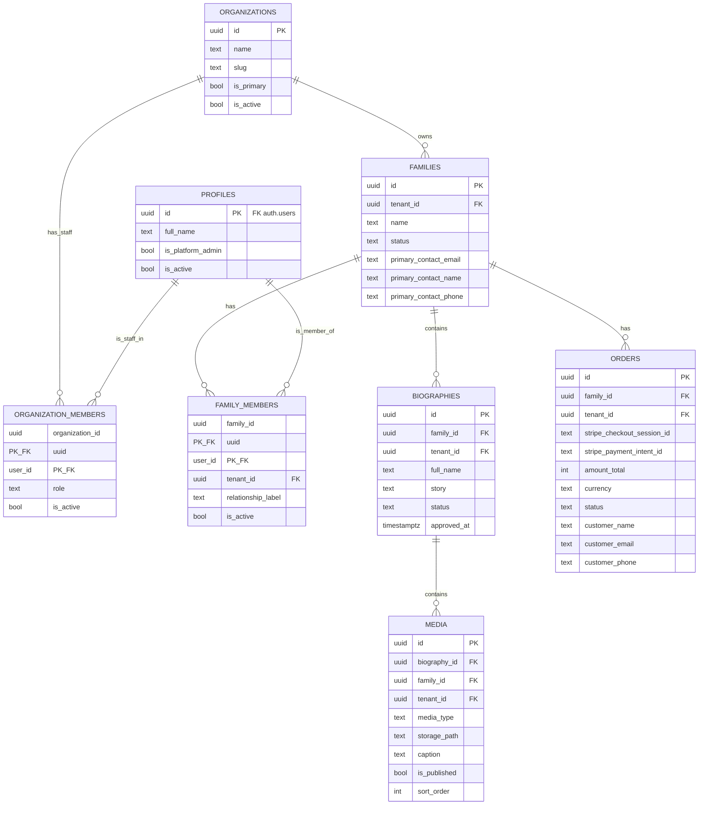

# living-echoes-platform

Living Echoes Digital Biography Platform — Phase 1

## Getting Started

```bash
npm run dev
```

Open [http://localhost:3000](http://localhost:3000).

## Database design (Phase 1)

**8 tables** (plus Supabase `auth.users`):

| Table | Role |
|-------|------|
| `organizations` | Tenant (branch). Its `id` is used as `tenant_id` elsewhere. |
| `profiles` | Global user identity (1:1 with `auth.users`). **No** `tenant_id`. |
| `organization_members` | Staff ↔ org join (`role`: admin, moderator, …). Composite PK `(organization_id, user_id)`. |
| `families` | Customer account container. |
| `family_members` | User ↔ family join. Composite PK `(family_id, user_id)`. |
| `biographies` | Memorial content under a family. |
| `media` | Photos/videos under a biography. |
| `orders` | Stripe purchase records. |

**Tenancy rule:** `tenant_id` on every tenant-scoped table. Exceptions: `organizations` (it *is* the tenant) and `profiles` (global identity; tenancy comes from memberships).


